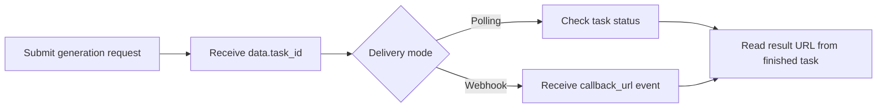

# Nano Banana 2 API with APIDot

Build with the Nano Banana 2 API using APIDot: cURL, Node.js, polling, webhooks, pricing, and fal.ai comparison in one production-oriented GitHub repo.

[Get API Key](https://apidot.ai/dashboard/api-key) | [API Docs](https://apidot.ai/docs/nano-banana-2) | [Model Page](https://apidot.ai/models/nano-banana-2) | [Main Examples](https://github.com/APIDotAI/apidot-examples)

## Why this repo exists

Use Nano Banana 2 when you need high-quality images, readable text, subject consistency, and faster iteration than Pro-focused workflows. `nano-banana-2` handles prompt-based generation, `nano-banana-2-edit` handles reference-guided editing, and both run through APIDot's async submit and status flow.

This repository turns that workflow into runnable server-side examples: a verified cURL request, a native Node.js polling example, webhook receiver notes, prompt examples, pricing context, and production integration guardrails.

## Overview

Nano Banana 2 is Google's Gemini 3.1 Flash Image model for fast image generation and conversational editing. It belongs to the Nano Banana image family and is built for teams that need production-ready visuals, reference-guided edits, readable text, and flexible output tiers without using a heavier Pro workflow for every request.

Nano Banana 2 is strongest when speed and control need to work together: rapid prompt iteration, natural-language edits, subject consistency, cleaner in-image text, optional Google Search context, and 0.5K through 4K output. That mix makes it a practical choice for product mockups, ad variants, storyboard frames, social assets, and high-volume creative testing.

On APIDot, `nano-banana-2` and `nano-banana-2-edit` share one Bearer-token workflow, `/api/generate/submit` endpoint, async `task_id` lifecycle, polling, and callback delivery pattern. You can choose resolution, aspect ratio, output format, seed, and `google_search`, while pricing stays clear across 0.5K, 1K, 2K, and 4K credit tiers for both generation and editing.

## Capabilities

- Generating high-quality images with Flash-level speed: Nano Banana 2 is positioned for fast image generation while keeping strong visual fidelity. It fits workflows where teams need to test many prompts, produce batches of creative options, or move from draft to usable image without waiting for a slower premium model.
- Creating readable text for ads, labels, posters, and UI: The model is designed to handle in-image text more reliably than older general image generators. This helps with packaging copy, signs, poster headlines, interface-style labels, infographic callouts, and other assets where text needs to be understandable.
- Using reference images for natural-language editing: `nano-banana-2-edit` accepts reference image URLs and lets users describe changes in plain language. It is useful for changing backgrounds, style, lighting, clothing, product context, or local details while preserving the parts of the source image that matter.
- Maintaining subjects across characters, products, and scenes: Nano Banana 2 is a good fit when a person, product, object, or visual style should remain stable across variations. This matters for product catalogs, character sets, ad campaigns, multi-image creative tests, and scene continuity.
- Controlling resolution, aspect ratio, format, and seed: APIDot exposes practical controls for 0.5K, 1K, 2K, and 4K output, common and ultra-wide aspect ratios, `png`, `jpeg`, and `webp` formats, plus optional seed control. These settings help match generated assets to social, ecommerce, editorial, and automation requirements.
- Using Google Search for fresher visual context: When `google_search` is enabled, requests can use fresher context for prompts involving current brands, products, places, or topical references. Keep it off for purely fictional or fully specified internal assets where extra web context is not needed.

## Common use cases

Nano Banana 2 fits teams that need to turn around mockups, ad updates, and text-heavy image assets in the same day, then decide which directions are worth taking to higher-resolution output.

- Product mockups, ad key visuals, and same-day size variants
- Poster, label, and banner concepts that need readable in-image text
- Reference-guided product retouching, background swaps, and photo updates
- Image sets that keep the same character or product consistent across shots
- Storyboard frames, pitch visuals, and early pre-production image directions
- High-volume concept testing with 0.5K drafts before scaling up final picks

## Pricing on APIDot

Catalog price: $0.035 / generation.
Pricing snapshot: per generation | 0.5K: 7 credits ($0.035), 1K: 10 credits ($0.05), 2K: 15 credits ($0.075), 4K: 20 credits ($0.10)

This README uses the pricing data currently published in the APIDot model catalog. Check the APIDot model page before high-volume production runs.

### Model-specific pricing

- nano-banana-2: per generation | 0.5K: 7 credits ($0.035), 1K: 10 credits ($0.05), 2K: 15 credits ($0.075), 4K: 20 credits ($0.10)
- nano-banana-2-edit: per generation | 0.5K: 7 credits ($0.035), 1K: 10 credits ($0.05), 2K: 15 credits ($0.075), 4K: 20 credits ($0.10)

## APIDot vs fal.ai

For tiers with fal.ai comparison data in the APIDot catalog, APIDot shows up to 67% lower listed price. Treat this as a catalog snapshot and verify current pricing before launch.

| Tier | APIDot listed price | fal.ai listed price | Note |
| --- | ---: | ---: | --- |
| text-to-image \| 0.5K | $0.035 | $0.08 | APIDot is 56% lower in this tier |
| text-to-image \| 1K | $0.05 | $0.08 | APIDot is 38% lower in this tier |
| text-to-image \| 2K | $0.075 | $0.15 | APIDot is 50% lower in this tier |
| text-to-image \| 4K | $0.1 | $0.3 | APIDot is 67% lower in this tier |
| image editing \| 0.5K | $0.035 | $0.08 | APIDot is 56% lower in this tier |
| image editing \| 1K | $0.05 | $0.08 | APIDot is 38% lower in this tier |
| image editing \| 2K | $0.075 | $0.15 | APIDot is 50% lower in this tier |
| image editing \| 4K | $0.1 | $0.3 | APIDot is 67% lower in this tier |

## Quick start

    cp .env.example .env
    # Edit .env and set APIDOT_API_KEY
    cd node
    npm start

The same request shape is available as a copy-paste cURL example in curl/generate.md.

## API workflow



Use polling for local tests and webhook delivery for production queues. Store `data.task_id` before the first status check so retries, callbacks, and result URLs can be reconciled safely.

## Minimal API request

Submit to APIDot's unified async generation endpoint:

    POST https://api.apidot.ai/api/generate/submit
    Authorization: Bearer <APIDOT_API_KEY>
    Content-Type: application/json

Primary payload:

```json
{
  "model": "nano-banana-2",
  "callback_url": "https://your-domain.com/callback",
  "input": {
    "prompt": "Studio product image of a compact travel camera on a brushed aluminum desk with clear engraved text 'LUMA 42', soft morning window light, realistic black glass lens, clean editorial composition, subtle shadows, high detail, commercial product photography.",
    "resolution": "1K",
    "size": "auto",
    "output_format": "png",
    "google_search": false
  }
}
```

Generate or edit images with Google's Gemini 3.1 Flash Image model through APIDot's unified async submit endpoint.

This page documents the Nano Banana 2 workflow on APIDot. Nano Banana 2 is Google's Gemini 3.1 Flash Image model for prompt-driven generation and reference-guided editing. Use `nano-banana-2` for text-to-image requests and `nano-banana-2-edit` for controlled edits with up to 14 `input.image_urls` reference images. Both variants use the same async submit, status, and callback flow.

## Model IDs and request variants

### nano-banana-2

```json
{
  "model": "nano-banana-2",
  "callback_url": "https://your-domain.com/callback",
  "input": {
    "prompt": "Studio product image of a compact travel camera on a brushed aluminum desk with clear engraved text 'LUMA 42', soft morning window light, realistic black glass lens, clean editorial composition, subtle shadows, high detail, commercial product photography.",
    "resolution": "1K",
    "size": "auto",
    "output_format": "png",
    "google_search": false
  }
}
```

### nano-banana-2-edit

```json
{
  "model": "nano-banana-2-edit",
  "callback_url": "https://your-domain.com/callback",
  "input": {
    "prompt": "Keep the product shape and logo placement, replace the background with a bright kitchen counter scene, add natural daylight reflections, and make the image look like a clean ecommerce hero shot.",
    "resolution": "4K",
    "size": "16:9",
    "output_format": "webp",
    "google_search": false,
    "image_urls": [
      "https://your-domain.com/source-image.png"
    ]
  }
}
```

## Request parameters

| Field | Type | Required | Description |
| --- | --- | --- | --- |
| model | string | yes | Target model id. Use `nano-banana-2` or `nano-banana-2-edit`. |
| callback_url | string | no | Optional webhook callback URL for terminal task updates. |
| input | object | yes | Container for Nano Banana 2 generation or editing parameters. |
| input.prompt | string | yes | Main instruction describing the target image, edit intent, composition, style, subject details, and text requirements. |
| input.resolution | string | no | Resolution preset. Supported values: `0.5K`, `1K`, `2K`, `4K`. |
| input.size | string | no | Output size preset. Supported values: `auto`, `1:1`, `2:3`, `3:2`, `3:4`, `4:3`, `4:5`, `5:4`, `9:16`, `16:9`, `21:9`, `4:1`, `1:4`, `8:1`, `1:8`. |
| input.output_format | string | no | Output file format. Supported values: `png`, `jpeg`, `webp`. |
| input.google_search | boolean | no | APIDot-facing boolean that enables the upstream web search capability for fresher real-world context. Use it for prompts involving current brands, products, places, events, or other time-sensitive references. |
| input.seed | integer | no | Optional integer seed for more repeatable generation attempts. |
| input.image_urls | string[] | no | Reference image URLs. Required for `nano-banana-2-edit`; supports up to 14 images. |

## Practical integration notes

- Use `0.5K` or `1K` while testing prompts, then move to `2K` or `4K` when the image is closer to delivery.
- Use `nano-banana-2-edit` only when you send `input.image_urls` reference images for controlled edits; APIDot accepts up to 14 reference images.
- Choose `input.size`, `input.resolution`, `input.output_format`, and optional `input.seed` together so repeated jobs remain predictable.
- Store the returned `task_id` immediately so polling, retries, callbacks, and downstream processing stay idempotent.

## Polling and webhooks

APIDot media generation is asynchronous. Store data.task_id immediately after submit, poll /api/generate/status/{task_id} for local tests, and use callback_url webhooks for production queues where users may leave the page before completion.

Webhook handlers should verify task ownership, persist callback events, return 2xx quickly, and be idempotent because duplicate deliveries can happen.

## Response and errors

- code: HTTP-style status code. Successful submits return `200`.
- data.task_id: Async task identifier returned immediately after submission.
- data.status: Initial task status, typically `not_started`.
- data.created_time: ISO 8601 timestamp for task creation.

Common error classes:

- 400 invalid_request: Missing prompt, unsupported model, invalid resolution, invalid size, invalid output format, invalid seed, malformed `google_search`, missing `image_urls` for `nano-banana-2-edit`, or more than 14 reference images.
- 401 authentication_error: Missing, expired, or invalid Bearer API key.
- 402 insufficient_credits: The current prepaid balance cannot cover the estimated image generation cost.
- 429 rate_limited: The API key is temporarily above the allowed submit rate.

## Production notes

- Keep APIDot API keys in server-side environment variables.
- Persist task_id, selected model, request payload, user ID, and status together.
- Use a moderate polling interval for tests and webhooks for durable production callbacks.
- Validate source media URLs before submitting requests that depend on source files.
- Avoid logging API keys, private prompts, private media URLs, or callback URLs.
- Retry transient network failures with backoff, but do not retry unchanged invalid payloads.

## FAQ

### What is Nano Banana 2 on APIDot?

Nano Banana 2 is a fast Google image generation and editing model exposed through APIDot's unified async image API. Use it for text-to-image generation, reference-guided editing, readable text, subject consistency, and resolution-controlled output.

### What is the difference between `nano-banana-2` and `nano-banana-2-edit`?

`nano-banana-2` is the text-to-image variant for prompt-based generation. `nano-banana-2-edit` is the editing variant for requests that include one or more `image_urls` reference images and need controlled changes to existing visuals.

### Which resolutions and aspect ratios are supported?

APIDot supports `0.5K`, `1K`, `2K`, and `4K` resolution tiers for Nano Banana 2. The current tool supports `auto`, `1:1`, `2:3`, `3:2`, `3:4`, `4:3`, `4:5`, `5:4`, `9:16`, `16:9`, `21:9`, `4:1`, `1:4`, `8:1`, and `1:8` size presets.

### How much does Nano Banana 2 cost on APIDot?

Both text-to-image and image edit requests use the same resolution prices: 0.5K is 7 credits ($0.035), 1K is 10 credits ($0.050), 2K is 15 credits ($0.075), and 4K is 20 credits ($0.100).

### Does edit mode require reference images?

Yes. `nano-banana-2-edit` requires at least one `image_urls` item because the model needs source imagery for guided edits. If you want to generate from text alone, use `nano-banana-2`.

### What does `google_search` do?

`google_search` lets Nano Banana 2 use Google Search for prompts that benefit from fresher real-world context, such as current products, places, events, or brand references. Leave it disabled for fully fictional prompts or assets where every needed detail is already in the prompt.

### Which output formats are available?

Nano Banana 2 supports `png`, `jpeg`, and `webp` through APIDot. Use `png` for post-processing flexibility, `jpeg` for smaller files, and `webp` for web delivery.

### When should I choose Nano Banana 2 instead of Nano Banana Pro?

Choose Nano Banana 2 when speed, lower cost, and high-volume iteration matter. Choose Nano Banana Pro when the job is closer to final premium delivery and you want the Pro-focused quality and control tradeoff.

### Which Nano Banana 2 model id should I send?

Use `nano-banana-2` for text-to-image generation. Use `nano-banana-2-edit` when the request includes `input.image_urls` reference images and needs controlled editing behavior. Edit requests can include up to 14 reference images.

### What does `google_search` do?

APIDot exposes this option as `input.google_search`. When enabled, the request is forwarded to the upstream web search capability so prompts can use fresher real-world context, such as current products, places, public events, or brand references.

### Can I control output format?

Yes. Nano Banana 2 supports `input.output_format` with `png`, `jpeg`, and `webp`.

### Does edit mode require reference images?

Yes. `nano-banana-2-edit` should include at least one `input.image_urls` entry because the model needs source imagery for guided edits. You can provide up to 14 reference image URLs.

### Is APIDot the creator of the underlying model?

No. This is an APIDot integration repository for calling Nano Banana 2 through APIDot. Google is listed as the model provider in the APIDot catalog. Use the APIDot model page for current availability, pricing, and usage terms.

## Related links

- APIDot: https://apidot.ai
- Nano Banana 2 model page: https://apidot.ai/models/nano-banana-2
- Nano Banana 2 API docs: https://apidot.ai/docs/nano-banana-2
- APIDot quickstart: https://apidot.ai/docs/quickstart
- APIDot webhooks: https://apidot.ai/docs/webhooks
- Main APIDot examples repo: https://github.com/APIDotAI/apidot-examples

## Related APIDot model API repositories

More image API examples from APIDot:

| Model | Repository |
| --- | --- |
| GPT Image 2 | [gpt-image-2-api](https://github.com/APIDotAI/gpt-image-2-api) |
| Nano Banana Pro | [nano-banana-pro-api](https://github.com/APIDotAI/nano-banana-pro-api) |
| Seedream 4.5 | [seedream-4.5-api](https://github.com/APIDotAI/seedream-4.5-api) |


